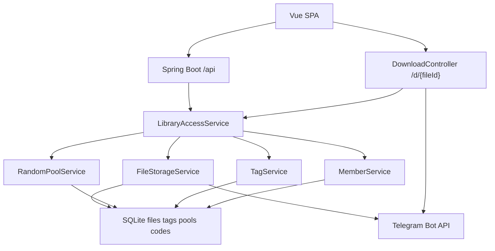

# File Libraries Technical Design

Feature Name: file-libraries
Updated: 2026-09-17

## Description

在 tgDrive 上落地 Tele 库、共享库、私密库、标签、共享库随机池、画廊与会员升级。文件本体继续存放在 Telegram；SQLite 增加库归属、会员等级、白名单、标签、随机池与兑换码。转入是搬走：更新 `files.library`，同一 `file_id` 不重复上传。共享库 `/d/{fileId}` 可匿名下载；私密库下载与列表仅 `admin`、`vvip`、白名单用户可过。

## Architecture



上传仍走现有 `FileController` / `FileStorageServiceImpl`，默认 `library=tele`。列表、转入、画廊走新的 library API。下载在 `DownloadServiceImpl.downloadFile` 入口按库鉴权：`shared` 放行；`private` 校验登录且（admin 或 vvip 或白名单）；`tele` 校验 owner 或 admin。

管理端与用户端复用现有 Layout，新增路由与侧栏，不拆独立应用。

## Components and Interfaces

### LibraryAccessService

集中判断当前用户对某条 `FileInfo` 的 list / download / mutate 权限。

- `canList(library, user)`：`tele` 看自己；`shared` 需登录；`private` 需 admin/vvip/whitelist
- `canDownload(file, user)`：按 Requirement 10
- `isPrivateAuthorized(user)`：admin 或 member_level=vvip 或白名单

### FileLibraryService

- `list(library, keyword, tags, page, size)`
- `transfer(fileIds, targetLibrary, contentLevel)`：仅 admin；目标 `shared`/`private`；源必须是 `tele`
- `restoreToTele(fileIds)`：仅 admin；源必须是 `shared`/`private`；转出后清随机池标记，标签保留

### TagService

- 目录 CRUD：仅 admin
- `setFileTags(fileId, tagIds)`：Tele 库限 owner；shared/private 限 admin
- 转入时标签随 `file_id` 保留

### RandomPoolService

- 仅 `library=shared` 可 `in_random_pool=1`
- 文件夹 CRUD、批量加入/移出/移动
- `randomOne(tags, folderId)`、`gallery(page, tags, type, folderId)`：登录用户，数据源只有共享库随机池

### MemberService

- admin 改 `member_level`：升级立即写库；降级必须请求体 `confirmDemote=true`
- 兑换：校验 code 有效、未过期、enabled、未耗尽、该用户未兑过；成功则升到更高一级并记 `redeem_records`

### HTTP API

| Method | Path | Auth | 说明 |
|--------|------|------|------|
| GET | `/api/libraries/{library}/files` | login；private 另需授权 | library=`tele\|shared\|private` |
| POST | `/api/libraries/transfer` | admin | `{fileIds, targetLibrary, contentLevel?}` |
| POST | `/api/libraries/restore` | admin | `{fileIds}` 搬回 tele |
| GET/POST/PATCH/DELETE | `/api/admin/tags` | admin | 标签目录 |
| POST | `/api/files/{fileId}/tags` | owner 或 admin | 打标 |
| GET/POST/PATCH/DELETE | `/api/admin/pool/folders` | admin | 随机池文件夹 |
| POST | `/api/admin/pool/files` | admin | 加入/移出/移动 |
| GET | `/api/gallery` | login | 共享库随机池分页 |
| GET | `/api/random` | login | 抽 1 条共享库随机池 |
| GET/POST/DELETE | `/api/admin/private-whitelist` | admin | 白名单 |
| POST | `/api/auth/redeem` | login | 兑换会员 |
| GET/POST/PATCH/DELETE | `/api/admin/redeem-codes` | admin | 兑换码 |
| PUT | `/api/auth/admin/users/{id}/level` | admin | `{memberLevel, confirmDemote?}` |

现有 `/api/file-list`、`/api/upload` 保留。`/fileList` 增加 library、content_level 列。`GET /d/{fileId}` 增加鉴权，共享库保持匿名可下。

### Frontend

用户端：`/user/tele`、`/user/shared`、`/user/gallery`；授权用户另显示 `/user/private`；账户页兑换码。

管理端：`/tele-library`、`/shared-library`、`/private-library`、`/tags`、`/gallery`、`/private-whitelist`、`/redeem-codes`；用户管理增加会员等级（降级二次确认）。

侧栏按 `role` 与 `isPrivateAuthorized` 动态显示私密库。

## Data Models

Flyway `V13__FileLibraries.sql`。

```sql
ALTER TABLE files ADD COLUMN library TEXT NOT NULL DEFAULT 'tele';
ALTER TABLE files ADD COLUMN content_level TEXT;
ALTER TABLE files ADD COLUMN in_random_pool INTEGER NOT NULL DEFAULT 0;
ALTER TABLE files ADD COLUMN pool_folder_id INTEGER;
CREATE INDEX idx_files_library ON files(library);
CREATE INDEX idx_files_random ON files(library, in_random_pool);

UPDATE files SET library = 'shared' WHERE is_public = 1;

ALTER TABLE users ADD COLUMN member_level TEXT NOT NULL DEFAULT 'pt';
UPDATE users SET member_level = 'vvip' WHERE role = 'admin';

CREATE TABLE tags (
  id INTEGER PRIMARY KEY AUTOINCREMENT,
  name TEXT NOT NULL UNIQUE
);

CREATE TABLE file_tags (
  file_id TEXT NOT NULL,
  tag_id INTEGER NOT NULL,
  PRIMARY KEY (file_id, tag_id)
);

CREATE TABLE pool_folders (
  id INTEGER PRIMARY KEY AUTOINCREMENT,
  name TEXT NOT NULL UNIQUE
);

CREATE TABLE private_whitelist (
  user_id INTEGER PRIMARY KEY
);

CREATE TABLE redeem_codes (
  id INTEGER PRIMARY KEY AUTOINCREMENT,
  code TEXT NOT NULL UNIQUE,
  code_type TEXT NOT NULL,
  target_member_level TEXT NOT NULL,
  max_uses INTEGER NOT NULL DEFAULT 1,
  used_count INTEGER NOT NULL DEFAULT 0,
  expires_at TEXT,
  enabled INTEGER NOT NULL DEFAULT 1
);

CREATE TABLE redeem_records (
  id INTEGER PRIMARY KEY AUTOINCREMENT,
  code_id INTEGER NOT NULL,
  user_id INTEGER NOT NULL,
  redeemed_at INTEGER NOT NULL,
  UNIQUE (code_id, user_id)
);
```

`FileInfo` 增加 `library`、`contentLevel`、`inRandomPool`、`poolFolderId`、`tags`。`User` 增加 `memberLevel`。`is_public` 保留，写入时与 `library==shared` 同步，避免旧查询分叉。

插入文件默认：`library=tele`、`in_random_pool=0`、`content_level=NULL`。转入 private 时必填 `content_level`。

## Correctness Properties

- 一条 `files` 记录同一时刻只属于一个 library
- 转入不新建 Telegram 文件、不复制 `file_id`
- `in_random_pool=1` 仅允许 `library=shared`
- 私密库 list/download 仅 admin、vvip、白名单
- 共享库 `/d/{fileId}` 匿名可下；私密库匿名 401
- 同一用户对同一兑换码最多成功一次；`once` 码成功后 `used_count` 达到上限即耗尽
- 兑换只升不降；管理员降级必须 `confirmDemote=true`
- WebDAV 新建文件 `library=tele`

## Error Handling

| 场景 | 响应 |
|------|------|
| 未登录访问共享库列表 / 画廊 / 随机 | HTTP 401，`Result.error` |
| 未授权访问私密库列表或下载 | HTTP 403 |
| 未登录下载私密库直链 | HTTP 401 |
| 非 admin 转入/转出/改随机池 | HTTP 403 |
| 对 tele/private 文件加入随机池 | HTTP 400 |
| 转入 private 缺 content_level | HTTP 400 |
| 兑换码无效/过期/耗尽/已兑过 | HTTP 400，等级不变 |
| 管理员降级且未确认 | HTTP 400 |
| 随机池为空 | HTTP 404 |
| 文件删除 | 清 `file_tags`、随机池标记，再走现有 Telegram 删除 |

HTTP 状态由 `GlobalExceptionHandler` 映射；业务体仍用 `Result.code`。下载接口是 `ResponseEntity`，私密库失败直接设 401/403，不返回文件流。

## Test Strategy

- 迁移：`is_public=1` → `shared`；admin → `vvip`；其余用户 `pt`
- 上传默认 tele；user 只能列出自己的 tele
- admin 转入 shared 后 tele 列表消失，登录用户能在 shared 看到；访客列表 401，直链 200
- admin 转入 private 后，pt 用户 403；vvip 与白名单 200 且看到全部
- 用户给自己的 tele 文件打标，转入后标签仍在；用户不能新建标签目录
- 随机池拒绝 private；画廊不含 private/tele
- 兑换：once 全站一次；repeatable 每用户一次；已兑过再兑失败
- 管理员降级无 `confirmDemote` 失败；带确认后立即失去私密库入口
- WebDAV 上传仍为 tele；私密库仅授权账号出现在 listing

回归：现有上传分片、WebDAV、Sa-Token 登录、文件删除。

## References

[^1]: (Spec) - requirements.md
[^2]: (FileController.java) - 现有上传与公开开关
[^3]: (DownloadController.java) - `/d/{fileId}` 下载入口
[^4]: (FileMapper.java) - files 查询与 `is_public` 过滤
[^5]: (V8__AddIsPublicColumn.sql) - 现有公开字段迁移
